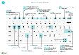

# Näppäimistön Pikaohje - Vain PCKeyboard Quick Reference - PC Only

#### YleisetGeneral

|Paina näitä näppäimiäPress these keys|TehtäväTo do this|  
|-|-|
|Alt+F2Alt+F2|Näytä ja piilota tietoruutuShow and hide the FactBox pane|
|Alt+NAlt+N|Luo uusi tietueCreate a new record|
|Alt+Vaihto+NAlt+Shift+N|Sulje juuri luotu tietue ja luo uusi tietueClose a newly created record and create a new one|
|Alt+OAlt+O|Lisää uusi huomautus valittuun tietueeseenAdd a new note for the selected record|
|Alt+QAlt+Q|Avaa **Kerro**Open **Tell me**|
|Alt+YlänuoliAlt+Up|Avaa työkaluvihje tai tarkistusvirheOpen tooltip or validation error|
|Alt+alanuoliAlt+Down Arrow|Avaa avattava luettelo tai hakuOpen a drop-down or look up|
|Alt+TAlt+T|Avaa **Omat asetukset** -sivuOpen the **My Settings** page|
|Alt+Vaihto+WAlt+Shift+W|Avaa nykyinen kortti tai asiakirja uudessa ikkunassaOpen the current card or document in a new window|
|Ctrl+InsertCtrl+Insert|Lisää uusi rivi asiakirjaanInsert a new line on a document|
|Ctrl-DeleteCtrl-Delete|Poista asiakirjan, päiväkirjan tai työkirjan riviDelete the line on a document, journal, or worksheet|
|Ctrl+Shift+F12Ctrl+Shift+F12|Suurenna asiakirjasivun rivinimikeosaMaximize the line items part on a document page|
|Ctrl+F1Ctrl+F1|Avaa sivun ohjeOpen help for the page Siirry mukautettaessaNavigate when personalizing and customizing|
|Ctrl+napsautusCtrl+Click|Siirry mukautettaessaNavigate when personalizing and customizing|
|Shift+F12Shift+F12|Avaa roolinhallinta, ominaisuuksien yleiskuvausOpen the role explorer, a feature overview|
|F5/Ctrl+F5F5/Ctrl+F5|Päivitä tai lataa sivu uudelleenRefresh/reload page|
|Sarkain/vaihto+sarkainTab/Shift+Tab|Siirrä kohdistus seuraavaan/edelliseen elementtiinMove focus to the next/previous element|
|F6/Vaihto+F6F6/Shift+F6|Siirry seuraavaan pikavälilehteen/osaanMove to next FastTab/part|

#### Siirtyminen ja rivien valitseminenNavigate & Select Rows

|Paina näitä näppäimiäPress these keys|TehtäväTo do this|
|-|-|
|Home/EndHome/End|Siirry ensimmäiseen/viimeiseen kenttäänGo to first/last field|
|Ctrl+Home/EndCtrl+Home/End |Siirry ensimmäiselle/viimeiselle rivilleGo to first/last row|
|Ctrl+ylä-/alanuoliCtrl+Up/Down|Siirry menettämättä valintaaNavigate without losing selection|
|Ctrl+ACtrl+A |Valitse kaikkiSelect all|
|Ctrl+välilyöntiCtrl+Space|Vaihda rivin valintaaToggle row selection|
|Ctrl/Vaihto+napsautusCtrl/Shift+Click|Lisää rivit valintaanAdd the row/rows to the selection|
|Vaihto+ylä-/alanuoliShift+Up/Down|Lisää rivi valinnan ylä-/alapuolelleAdd row above/below to selection|
|Vaihto+sivu ylös/alasShift+Page Up/Down|Valitse näkyvät rivit ylä-/alapuolellaSelect visible rows above/below|
|Ctrl+EnterCtrl+Enter|Kohdistus luettelon ulkopuolellaFocus out of the list|

#### Kopioi ja liitäCopy & Paste

|Paina näitä näppäimiäPress these keys|TehtäväTo do this|
|-|-|
|Ctrl+C/VCtrl+C/V|Kopioi/liitä rivitCopy/paste rows|
|F8F8|Kopioi yläpuolella oleva kenttä nykyiselle rivilleCopy field above into current row|

#### Haku, suodatus ja lajitteluSearch, Filter, & Sort

|Paina näitä näppäimiäPress these keys|TehtäväTo do this|
|-|-|
|Alt+F7Alt+F7|Lajittele sarake nousevaan/laskevaan järjestykseenSort column in ascending/descending order|
|F3F3|Vaihda hakuunToggle search|
|Shift+F3Shift+F3|Vaihda suodatinruutuun: kohdistus kenttäsuodattimissaToggle filter pane; focus on field filters|
|Alt+F3Alt+F3|Suodata valitun solun arvon mukaanFilter on selected cell value|
|Vaihto+Alt+F3Shift+Alt+F3|Lisää valittuun kenttään suodatinAdd filter on selected field|
|Ctrl+Alt+Vaihto+F3Ctrl+Alt+Shift+F3|Nollaa suodattimetReset filters|

#### PikatapahtumaQuick Entry

|Paina näitä näppäimiäPress these keys|TehtäväTo do this|
|-|-|
|Ctrl+Vaihto+EnterCtrl+Shift+Enter|Siirry seuraavaan pikatapahtumakenttään luettelon ulkopuolellaGo to next Quick Entry field outside a list|
|Enter/vaihto+EnterEnter/Shift+Enter|Siirry seuraavaan/edelliseen pikatapahtumakenttäänGo to next/previous Quick Entry field|
##### Raportin esikatseluReport Preview

|Paina näitä näppäimiäPress these keys|TehtäväTo do this|
|-|-|
|Ctrl+Home/EndCtrl+Home/End|Siirry ensimmäiselle/viimeiselle sivulleGo to the first/last page|

> [!TIP]
> Jos haluat graafisen, tulostusystävällisen version, valitse seuraava kuva ja Lataa PDF-tiedosto.For a graphical, print-friendly version, choose the following image and download the PDF file.
>
> 

[!INCLUDE[footer-include](includes/footer-banner.md)]