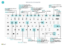

# Pikanäppäimet

Tässä artikkelissa käsitellään yleisesti [!INCLUDE[prod_short](includes/prod_short.md)] -ohjelman joitakin pikanäppäinyhdistelmiä.

Yleistietoja suosituimmista pikanäppäimistä on kohdassa [Pikanäppäimet (vain PC)](keyboard-shortcuts-cheatsheet.md).

> [!TIP]
> Jos haluat graafisen näkymän eniten käytetyistä pikanäppäimistä, valitse seuraava kuva ja lataa PDF-tiedosto.  
> 

## Yleiskuvaus

Pikanäppäimet ovat helppokäyttötoimintoja. Ne auttavat ja tehostavat sivun eri alueiden ja elementtien välillä siirtymistä. Useimmat selaimet tukevat pikanäppäimiä, joskin niiden toiminta voi vaihdella jonkin verran eri selaimissa.

> [!NOTE]
> Tässä käsitellyt pikanäppäimet viittaavat yhdysvaltaiseen näppäimistöön. Muiden näppäimistöjen näppäimet eivät ehkä vastaa täsmälleen yhdysvaltalaisen näppäimistön näppäimiä.

Useimmat pikanäppäimet ovat samoja sekä Windows- että macOS-käyttöjärjestelmissä. Jotkin pikanäppäimet ovat kuitenkin erilaisia macOS-järjestelmässä. Seuraavissa osa macOS-käyttöjärjestelmän pikanäppäimet ovat sulkeissa.

> [!NOTE]
> Tässä artikkelissa käsiteltyjen yleisten pikanäppäimien lisäksi käytössä on useita liiketoimintakohtaisia pikanäppäimiä. Esimerkiksi [!INCLUDE[prod_short](includes/prod_short.md)]in yleisessä versiossa F9 kirjaa asiakirjan ja CTRL+F7 näyttää tietueen kirjanpitotapahtumat, kun avataan tietue kortissa. Tämä artikkeli sisältää joitakin yleisempiä yrityskohtaisia pikanäppäimiä, jotka näkyvät kursivoituna. Huomaa, että todelliset pikakuvakkeet voivat olla erilaisia ratkaisussa. Käyttöliittymässä pikanäppäin näkyy kyseisen toiminnon työkaluvihjeessä.

##   Yleiset pikanäppäimet

Seuraavassa taulukossa on kuvattu sivun eri elementtien selaamiseen ja käyttämiseen liittyvät pikanäppäimet. Elementtejä ovat esimerkiksi toiminnot, avattavat luettelot ja haut. Lisätietoja luettelon tietueiden välillä siirtymisessä käytettävistä pikanäppäimistä on seuraavassa osassa.

|Paina näitä näppäimiä (macOS)|Tehtävä|
|--------------------------------|----------|
|Alt+alanuoli|Avaa avattava luettelo tai hae kentän arvo.|
|Alt+ylänuoli|Näyttää taulukokon kentän tai sarakeotsikon työkaluvihjeen. Jos kentässä on tarkistusvirheitä, tarkistusvirhe tulee näkyviin näppäinyhdistelmällä Alt+ylänuoli. Sulje työkaluvihje painamalla Esc-näppäintä tai näppäinyhdistelmää Alt+ylänuoli.|
|F2|Vaihda koko kentän arvon valitsemisen tai kohdistimen asettamisen välillä kentän arvon loppuun.|
|Alt+F2|Näytä ja piilota tietoruutu.|
|Alt+Vaihto+F2|Siirry tietoruudun **tietojen** ja **liitteiden** välillä.|
|Alt+O|Lisää uusi muistio valittuun tietueeseen, vaikka tietoruutu ei olisi auki.|
|Alt+Q (Ctrl+Optio+Q)|Avaa **Kerro, mitä haluat tehdä** -ikkuna. Lisätietoja on kohdassa [Sivujen ja tietojen etsiminen Kerro, mitä haluat tehdä -toiminnolla](ui-search.md).|
|Alt+N |Luo uusi tietue avaamalla sivu. (Vastaa **Uusi**- ja **+**-toimintojen valitsemista.)|
|Alt+Vaihto+N |Sulje juuri luotu sivu ja luo uusi tietue avaamalla uusi sivu. Vastaavasti ALT+F9 kirjaa asiakirjan ja luo uuden.|
|Alt+T|Avaa **Omat asetukset** -sivu.|
|Alt+Oikea nuoli|Etsi sen kentän lisätietoja tai taustalla olevia arvoja, joka sisältää  -painikkeen. Tätä pikanäppäintä käytetään silloin, kun tavallista avattavan luettelon painiketta (Alt+alanuoli) käytetään samassa kentässä toiseen tarkoitukseen.|
|Ctrl+Alt+Vaihto+C|Näytä yrityksen tunnuksessa olevat tiedot.|
|Ctrl+Alt+F1|Avaa ja sulje sivun tarkastusruutu Sivun tarkastusruudussa on tietoja sivusta, kuten sen lähdetaulukko, kentät, suodattimet ja laajennukset.  Lisätietoja on kohdassa [Tarkastussivut](across-inspect-page.md).|
|Ctrl+C |Kopioi kentän arvo. Jos kohdistus on kentässä etkä ole valinnut kentässä tekstiä, koko arvo kopioidaan. Jos olet valinnut kentässä tekstiä, vain valittu teksti valitaan.|
|Ctrl+F1|Avaa sivun Business Central -ohje.|
|Ctrl+F12|Vaihtele leveää ja kapeaa asettelua.|
|Ctrl+napsautus|Siirry mukautusten aikana, kun nuolenpää osoittaa toiminnon valinnan. Lisätietoja on kohdassa [Työtilan mukauttaminen](ui-personalization-user.md).|  
|Ctrl+F5|[!INCLUDE[prod_short](includes/prod_short.md)] -sovellus ladataan uudelleen. (Vastaa selaimen päivittämistä tai sivun uudelleen avaamista selaimessa.)|
|F5|Tietojen päivitys nykyisellä sivulla.  Voit varmistaa tällä näppäimellä, että sivulla näkyvät tiedot sisältävät kaikki muiden oman työskentelysi aikana tekemät muutokset.|
|Syötä|Ota kohdistettu elementti tai ohjausobjekti käyttöön tai käytä sitä.|
|Esc|Sulje nykyinen sivu tai avattava luettelo.|
|Sarkain|Siirrä kohdistus sivun seuraavaan ohjausobjektiin tai elementtiin, kuten toimintoon, painikkeeseen, kenttään tai luettelon otsikkoon.|
|Vaihto+Sarkain|Siirrä kohdistus sivun edelliseen ohjausobjektiin tai elementtiin, kuten toimintoon, painikkeeseen, kenttään tai luettelon otsikkoon.|
|K ja E|Aktivoi **Kyllä**- ja **Ei** -painikkeet valintaikkunoissa. Todelliset näppäimet vaihtelevat **Omat asetukset** -kohdassa määritetyn nykyisen kielen mukaan. Paina esimerkiksi J aktivoidaksesi **Ja**-painikkeen saksan kieltä käyttäessäsi.|

## Luettelon pikanäppäimet

Seuraavassa taulukossa kuvataan luettelosivulla käytettävät pikanäppäimet. Pikanäppäintoiminto on hieman erilainen riippuen siitä, näytetäänkö sivu luettelo- vai ruutunäkymässä.
<!--
> [!Note]
> In the table that follows, the term *actionable field* refers to a field on which you can do something, like change a value or link to another page. In general, the shortcuts will skip over fields that display information that you cannot change from the list (in other words, fields that are read-only).
-->
### Yleiset

|Paina näitä näppäimiä (macOS)|Luettelonäkymän toiminnot|Ruutunäkymän toiminnot |
|--------------------------------|-------------------------|--------------------------|
|Alt+F7 |Lajittele valittu sarake nousevaan tai laskevaan järjestykseen.|Ei sovellu.|
|Alt+N|Lisää uusi rivi muokattavaan luetteloon, kuten **KP-budjetit**-sivulle.|Sama.|
|Shift+F9|Kirjaa ja tulosta asiakirja.|Sama.|
|Shift+F10 |Avaa valitulla rivillä käytettävissä olevien asetusten valikko.|Sama.|
|Alt + D|Avaa dimensioyhdistelmän tapahtumat.|Sama.|
|Ctrl+F7|Avoimet tapahtumat, lokitapahtumat, kustannustapahtumat ja niin edelleen.|
|Ctrl+F9|Vapauta asiakirja.|Sama.|
|*F7*|Avaa tilastot.|Sama.|
|*F9*|Kirjaa, myönnä, rekisteröi tai peruuta asiakirja.|Sama.|
|*Shift + Ctrl + F*|Lähetä ehdotetut rivit kassavirtalaskentataulukkosivulla.|Ei sovellu.|
|*Shift + Ctrl + I*|Tarkastele sarja- ja eränumeroita, jotka on nimitetty asiakirjan tai päiväkirjan nimikkeelle.|Ei sovellu.|

### Rivien ja sarakkeiden välillä siirtyminen

Rivejä ja sarakkeita sisältäviä ruudukoita on useilla sivutyypeillä sovelluksessa [!INCLUDE[prod_short](includes/prod_short.md)]. Sivuja ovat esimerkiksi luettelosivut ja asiakirjojen **Rivit**-osat. Siirtyminen yhdestä solusta toiseen ruudukossa voidaan tehdä täysin näppäimistön avulla.

| Paina näitä näppäimiä (macOS) | Luettelonäkymän toiminnot | Ruutunäkymän toiminnot |
|--|--|--|
| Ctrl+Home (Fn+vasen nuoli) | Valitse luettelon ensimmäinen rivi; kohdistuu pysyy samassa sarakkeessa. | Siirry ensimmäisen rivin ensimmäiseen ruutuun. |
| Ctrl+End (Fn+Ctrl+oikea nuoli) | Valitse luettelon viimeinen rivi; kohdistuu pysyy samassa sarakkeessa. | Siirry viimeisen rivin viimeiseen ruutuun. |
| Kotitalous (Fn+vasen nuoli) | Siirry rivin ensimmäiseen kenttään. | Siirry rivin ensimmäiseen ruutuun. |
| End (Fn+oikea nuoli) | Siirry rivin viimeiseen kenttään. | Siirry rivin viimeiseen ruutuun. |
| Syötä | Avaa tähän kenttään liittyvä tietue.  Käytetään vain, jos korttisivu on liitetty tietueeseen. | Avaa tietueen.  Käytetään vain, jos korttisivu on liitetty tietueeseen. |
| Ctrl+Enter | Siirrä kohdistus seuraavaan luettelon ulkopuolella olevaan elementtiin. | Siirrä kohdistus seuraavaan luettelon ulkopuolella olevaan elementtiin. |
| Sivu ylös (Fn+ylänuoli) | Vieritä näkymän nykyisten rivien yläpuolella olevat rivit näkyviin. | Vierittää näkymän nykyisten ruutujen yläpuolella olevat ruutujoukot näkyviin. |
| Sivu alas (Fn+alanuoli) | Vieritä näkymän nykyisten rivien alapuolella olevat rivit näkyviin. | Vieritä näkymän nykyisten ruutujen alapuolella olevat ruutujoukot näkyviin. |
| Nuoli alas | Siirry saman sarakkeen alemman rivin kenttään. | Siirry saman sarakkeen alemman rivin ruutuun. |
| Ylänuoli | Siirry saman sarakkeen ylemmän rivin kenttään. | Siirry saman sarakkeen ylemmän rivin ruutuun. |
| Oikea nuoli | Siirry vain luku -luettelossa saman rivin seuraavaan oikealla olevaan kenttään.  Siirry muokattavassa luettelossa oikealle nykyisestä kentästä. | Siirry saman rivin seuraavaan oikealla olevaan ruutuun. |
| Vasen nuoli | Siirry vain luku -luettelossa saman rivin edelliseen vasemmalla olevaan kenttään.   Siirry muokattavassa luettelossa vasemmalle nykyisestä kentästä. | Siirry saman rivin edelliseen vasemmalla olevaan ruutuun. |
| Sarkain | Siirry muokattavassa luettelossa saman rivin seuraavaan oikealla olevaan kenttään. | Ei sovellu. | 
| Vaihto+Sarkain | Siirry muokattavassa luettelossa saman rivin edelliseen vasemmalla olevaan kenttään. | Ei sovellu. |

### Valitseminen, kopioiminen ja liittäminen

|Paina näitä näppäimiä (macOS)|Luettelonäkymän toiminnot |Ruutunäkymän toiminnot |
|--------------------------------|--------------------------|--------------------------|
|Ctrl+napsautus (Cmd+napsautus)|Laajentaa valitut rivit, myös valitun rivin.|Ei sovellu.|
|Vaihto+napsautus|Laajentaa valitut rivit, myös valitun rivin ja kaikki välissä olevat rivit.  Voit käyttää tätä sen jälkeen, kun valinta on laajennettu käyttämällä yhdistelmää Ctrl+ylänuoli tai Ctrl+alanuoli.|Ei sovellu.|
|Ctrl + Ylänuoli (Ctrl+Cmd+ylänuoli)|Siirrä kohdistus ylempään riviin ja pidä nykyinen rivi valittuna.|Ei sovellu.|
|Ctrl+ alanuoli (Ctrl+Cmd+alanuoli)|Siirrä kohdistus alempaan riviin ja pidä nykyinen rivi valittuna.|Ei sovellu.|
|Ctrl+välilyönti (Ctrl+Cmd+välilyönti)|Laajentaa valitut rivit sisältämään rivin, jolla on kohdistus.  Voit käyttää tätä sen jälkeen, kun valinta on laajennettu käyttämällä yhdistelmää Ctrl+ylänuoli tai Ctrl+alanuoli.|Ei sovellu.|
|Ctrl+A|Valitse kaikki rivit.|Ei sovellu.|
|Ctrl+C (Cmd+C)|Kopioi valitut rivit leikepöydälle.|Kyllä mutta vain yksi valittu ruutu.|
|Ctrl+V (Cmd+V)|Liitä valitut rivit leikepöydältä nykyiselle sivulle tai ulkoiseen asiakirjaan, kuten Microsoft Excel -asiakirjaan tai Outlook-sähköpostiviestiin. Tämän voi tehdä vain muokattavissa luetteloissa.|Ei sovellu.|
|Vaihto+ylänuoli|Laajentaa valitut rivit, myös alapuolella olevan rivin.|Ei sovellu.|
|Vaihto+alanuoli|Laajentaa valitut rivit, myös yläpuolella olevan rivin.|Ei sovellu.|
|Vaihto+sivu ylös (Vaihto+Fn+ylänuoli)|Laajenna rivien valinta niin, että se sisältää kaikki valittujen rivien yläpuolella olevat näkyvissä olevat rivit.|Ei sovellu.|
|Vaihto+sivu alas (Vaihto+Fn+alanuoli)|Laajenna rivien valinta niin, että se sisältää kaikki valittujen rivien alapuolella olevat näkyvissä olevat rivit.|Ei sovellu.|
|F8|Kopioi kenttä yläpuolella olevan rivin samasta sarakkeesta ja liitä se nykyiselle riville. Tämän voi tehdä vain muokattavissa luetteloissa. Tämän pikanäppäimen ja Tab-näppäimen avulla voit täyttää nopeasti niiden rivinimikkeiden kentät, joihin haluat samat arvot kuin yllä olevalla rivillä.|Ei sovellu.|

### Luetteloiden lajitteleminen ja luetteloista hakeminen

|Paina näitä näppäimiä (macOS)|Tehtävä|
|--------------------------------|----------|
|F3|Vaihtaa hakuruutuun.<ul><li>Aktivoi hakuruudun niin, että voit alkaa kirjoittaa hakutekstiä.</li><li>Jos hakuruutu on jo aktivoitu, F3 palauttaa luettelon, eikä tyhjennä hakutekstiä.</li><ul>|
|Shift+F3|Avaa ja sulje suodatinruutu.<ul><li> Jos suodatinruutu ei ole avoinna, vaihto+F3 avaa sen ja keskittyy **Suodata luettelo** -kohdassa olevaan **+-suodatus**-toimintoon. Voit sitten vain painaa ENTER aloittaaksesi kenttäsuodattimen lisäämisen.</li><li>Jos suodatinruutu on jo auki, Vaihto+F3 sulkee sen. Lisäämiäsi suodattimia ei kuitenkaan tyhjennetä.</li></ul>|
|Ctrl+Shift+F3|Avaa ja sulje suodatinruutu.<ul><li> Jos suodatinruutu ei ole avoinna, Ctrl+vaihto+F3 avaa sen ja keskittyy **Suodata yhteensä** -kohdassa olevaan **+-suodatus**-toimintoon. Voit sitten vain painaa ENTER aloittaaksesi kokonaisarvojen suodattimen lisäämisen.</li><li>Jos suodatinruutu on jo auki, Ctrl+vaihto+F3 sulkee sen. Lisäämiäsi suodattimia ei kuitenkaan tyhjennetä.</li></ul>  |
|Alt+F3|Vaihda valitun arvon suodatusta.<ul><li>Ottaa käyttöön sarakkeen suodattimen luettelon valitun kentän arvossa. Tämä on sama toiminto kuin **Suodata tähän arvoon** -kohdan valitseminen sarakkeen otsikosta. Se avaa suodatinruudun ja määrittää valitulle arvolle suodattimen samalla, kun luettelon solu pysyy valittuna.</li><li>Jos sarake on jo suodatettu, Alt+F3 tyhjentää kyseisen sarakkeen suodattimen.</li></ul> |
|Vaihto+Alt+F3|Avaa suodatinruutu ja lisää suodatin luettelon valittuun sarakkeeseen. Uusi suodatin on valittuna. Voit siis alkaa kirjoittaa suodatusehtoja heti.   Tämä on sama toiminto kuin **Suodatin**-kohdan valitseminen sarakkeen otsikosta.  Jos kentässä on jo suodatin, uusi suodatin lisätään. |
|Ctrl+Vaihto+Alt+F3|Nollaa suodattimet. Tämä on sama toiminto kuin **Nollaa suodattimet** -kohta suodatinruudussa. Se otetaan käyttöön kentässä ja kokonaisarvojen suodattimessa.   Suodattimiksi palautetaan nykyisen näkymän oletussuodattimet. Jos nykyinen näkymä on **Kaikki**, tämä on sama kuin palaaminen kaikki tietueet sisältävään suodattamattomaan näkymään. |
|Ctrl+Enter|Muuta kohdistus suodatinruudusta takaisin luetteloon.|

## Korttien ja asiakirjojen pikanäppäimet

Seuraavilla pikanäppäimillä voi näyttää ja muokata tietueita korttisivuilla, kuten **Asiakaskortti**, ja asiakirjasivuilla, kuten **Myyntitilaus**.

|Paina näitä näppäimiä (macOS)|Tehtävä|
|--------------------------------|----------|
|Alt + D|Avaa dimensioyhdistelmän tapahtumat.|
|Alt+F6|Vaihtele nykyisen pikavälilehden tai osan (alasivu) tiivistystä ja laajennusta.|
|Alt+F9|Luo uusi asiakirja ja kirjaa se.|
|Alt+G|Avaa kirjattuun asiakirjaan liittyvien tapahtumien haku **Etsi tapahtumat** -sivulta. Toimii myös luetteloissa.|
|Alt+N |Lue uusi tietue avaamalla sivu; vastaa **Uusi**-toiminnon valitsemista. |
|Alt+Vaihto+N |Sulje sivu ja luo uusi tietue avaamalla uusi sivu; vastaa **OK ja uusi**-toiminnon valitsemista. |
|Alt+Vaihto+W |Avaa nykyinen kortti tai asiakirja uudessa ikkunassa. Lisätietoja on kohdassa [Monen tehtävää yhtä aikaa useilla sivuilla](ui-enter-data.md#multitasking-across-multiple-pages).|
|Ctrl+Enter|Tallenna ja sulje sivu.|
|Ctrl+ alanuoli|Avaa objektin seuraava tietue.|
|Ctrl + Ylänuoli |Avaa objektin edellinen tietue.|
|Ctrl+Insert |Lisää uusi rivi asiakirjoihin.|
|Ctrl+Delete |Poista asiakirjojen, päiväkirjojen ja työkirjojen rivi.|
|Ctrl+F7|Avoimet tapahtumat, lokitapahtumat, kustannustapahtumat ja niin edelleen.|
|Ctrl+F9|Vapauta asiakirja.|
|Ctrl+Shift+F12 |Suurenna asiakirjasivun rivinimikeosa. Palaa normaalinäyttöön painamalla näppäimiä uudelleen. Lisätietoja on kohdassa [Kohdistaminen rivinimikkeisiin](ui-enter-data.md#Focus).|
|F6|Siirry seuraavaan pikavälilehteen tai osaan (tai alisivulle).|
|*F7*|Avaa tilastot.|
|*F9*|Kirjaa, myönnä, rekisteröi tai peruuta asiakirja.|
|*Shift + Ctrl + F9*|Kirjaa, tulosta ja hyllytä fyysisen varastoinnin vastaanotto.|
|Shift+F6|Siirry edelliseen pikavälilehteen tai osaan (tai alisivulle).|
|*Shift + F9*|Kirjaa ja tulosta asiakirja.|

## Kenttien pikatapahtuman pikanäppäimet

Seuraavat pikanäppäimet koskevat korttien, asiakirjojen ja luettelosivujen pikatapahtumaominaisuutta. Pikanäppäimiä ei voi käyttää luetteloissa, kun luettelo on ruutunäkymässä. Lisätietoja pikatapahtumista on kohdassa [Tietojen syöttämisen helpottaminen pikatapahtuman avulla](ui-enter-data.md#QuickEntry).

|Paina näitä näppäimiä (macOS)|Tehtävä|Huomautukset|
|--------------------------------|----------|-------|
|Syötä|Vahvista nykyisen kentän arvo ja siirry seuraavaan pikatapahtumakenttään.||
|Vaihto+Enter|Vahvista nykyisen kentän arvo ja siirry edelliseen pikatapahtumakenttään.||
|Ctrl+Vaihto+Enter|Vahvista nykyisen sarakkeen arvo ja siirry seuraavaan luettelon ulkopuoliseen pikatapahtumakenttään.  Tämä pikanäppäin koskee sivulle upotettuja luetteloita, kuten myyntitilauksen rivinimikkeitä. Voit poistua sen avulla nopeasti luettelosta ja jatkaa tietojen lisäämistä sivun muihin kenttiin.|

##  Kalenterin pikanäppäimet (päivämäärän valitsin)

Päivämääräkenttää määrittäessäsi voit syöttää päivämäärän manuaalisesti tai avata kalenterin (päivämäärän valitsin), jonka avulla voit valita haluamasi päivämäärän. Seuraavassa taulukossa kuvataan kalenterin pikanäppäimet.

|Paina näitä näppäimiä (macOS)|Tehtävä|
|--------------------------------|----------|
|Ctrl+Home|Avaa kalenteri, jos se on suljettu. **Huomautus**: ei toimi, jos päivämääräkenttä on ruudukossa, jossa Ctrl+Home siirtää ensimmäiselle riville.|
|Ctrl+Home (Cmd + Home)|Siirry nykyisen kuukauden tähän päivään.|
|Ctrl+vasen nuoli (Cmd + Vasen nuoli)|Siirry edelliseen päivään.|
|Ctrl+Oikea nuoli (Cmd + Oikea nuoli)|Siirry seuraavaan päivään.|
|Ctrl + Ylänuoli (Cmd + ylänuoli)|Siirry edellisen viikon samaan viikonpäivään.|
|Ctrl+ alanuoli (Cmd+alanuoli)|Siirry seuraavan viikon samaan viikonpäivään.|
|Enter|Valitse kohdistettu päivä.|
|Ctrl+End (Cmd+End)|Sulje kalenteri ja poista nykyinen päivämäärä.|
|Esc|Sulje kalenteri ilman valintaa, säilytä nykyinen päivämäärä.|
|Sivu alas|Siirry seuraavaan kuukauteen.|
|Sivu ylös|Siirry edelliseen kuukauteen.|  

## Päivämääräkenttien pikanäppäimet

|Paina näitä näppäimiä (macOS)|Tehtävä|
|--------------------------------|----------|
|t|Anna kuluvan päivän päivämäärä. "T" tarkoittaa tänään.|
|k|Anna työn päivämäärä. Lisätietoja on kohdassa [Työn päivämäärä](ui-change-basic-settings.md#work-date)|

## Raportin esikatselun pikanäppäimet

|Paina näitä näppäimiä (macOS)|Tehtävä|
|--------------------------------|----------|
|Nuoli alas|Vieritä sivua alas.|  
|Ylänuoli|Vieritä sivua ylös.|
|Ctrl+0 (nolla) (Cmd+0)|Sovittaa koko sivun näkyviin. |
|Ctrl+Home (Cmd + Home)|Siirry raportin ensimmäiselle sivulle.|
|Ctrl+End (Cmd + Home)|Siirry raportin viimeiselle sivulle.|
|Vasen nuoli|Vieritä vasemmalle, kun sivua on lähennetty niin ettei koko sivu ole näkyvissä. |
|Oikea nuoli|Vieritä oikealle, kun sivua on lähennetty niin ettei koko sivu ole näkyvissä. |
|Sivu alas (Fn+alanuoli)|Siirry raportissa seuraavalle sivulle.|
|Sivu ylös (Fn+ylänuoli)|Siirry raportissa edelliselle sivulle.|

## Lähentämisen ja loitontamisen pikanäppäimet

|Paina näitä näppäimiä|Tehtävä|
|--------------------------------|----------|
|Ctrl++|Lähennä nykyistä sivua.|  
|Ctrl+-|Loitonna nykyistä sivua.|  
|Ctrl+0|Lähennä tai loitonna nykyistä sivua 100 prosentin kokoon.|  

## Roolien hallinnan pikanäppäimet

Roolien hallinta tarjoaa yleiskatsauksen ja nopean pääsyn kaikkiin roolisi käytettävissä oleviin liiketoimintaominaisuuksiin. Lisätietoja on kohdassa [Sivujen etsiminen roolinhallinnalla](ui-role-explorer.md).

|Paina näitä näppäimiä (macOS)|Tehtävä|
|--------------------------------|----------|
|Shift+F12|Avaa roolien hallinta.|
|F3|Avaa **Etsi**-ruutu roolien hallinnassa löytääksesi ominaisuuksia tietyllä hakusanalla tai termillä.|
|F3 tai Ctrl+ alanuoli|Siirtää kohdistuksen roolien hallinnan seuraavaan löytyneeseen toimintoon. F3 siirtää kohdistuksen **Etsi**-ruutuun viimeisen löydetyn ominaisuuden jälkeen.|
|VAIHTO + F3 tai CTRL + YLÄNUOLI|Siirrä kohdistus roolien hallinnan edelliseen löytyneeseen toimintoon.|
|Ctrl+Shift|Laajenna tai tiivistä kaikki alisolmut ylimmän tason solmujen lisäksi, kun valitset **Laajenna**- tai **Tiivistä**-toiminnon.|

## Katso myös

[Näppäimistön Pikaohje - Vain PC](keyboard-shortcuts-cheatsheet.md)  
[Aputoiminnot](ui-accessibility.md)  
[Valmistautuminen liiketoimintaan](ui-get-ready-business.md)  
[[!INCLUDE[prod_short](includes/prod_short.md)] -ohjelman käyttäminen](ui-work-product.md)  
[Usein kysytyt kysymykset](across-faq.yml)  
[Etsi tapahtumat](ui-find-entries.md)  

[!INCLUDE[footer-include](includes/footer-banner.md)]