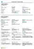

# [!INCLUDE[d365fin](includes/d365fin_md.md)] -ohjelman käyttäminen
Kun tehdään liiketoimintaan liittyviä tehtäviä, voit käsitellä tietoja eri tavoin, kuten tietueiden luominen ja tietojen syöttäminen, tietojen lajittelu ja suodatus, kirjalliset huomautukset ja tietojen lähettäminen muihin sovelluksiin.

Voit esimerkiksi säätää minkä tahansa sivun kokoa ja sijaintia, laajentaa sarakkeita ja kasvattaa sarakeotsikoiden korkeutta ja muuttaa sarakkeiden tietojen lajittelua. Ja jos haluat tarkastella kaikkia luettelosivun tai asiakirjarivien sarakkeita vaakavierityspalkin avulla, huomaat, että pystysuuntainen kiinnitysruutu estää tiettyjä sarakkeita vierittymästä.

## Vihjeet ja vinkit

> [!TIP]
> Jos haluat tulostettavan yleiskuvan eniten käytetyistä toiminnoista, valitse seuraava kuva ja lataa PDF-tiedosto.
>
> 

## Lisätietolinkkejä

Seuraava taulukko sisältää joitakin yleisiä toimintoja ja linkkejä niitä käsitteleviin ohjeaiheisiin.

> [!NOTE]
> Tässä osassa kuvattujen käyttöliittymän yleisten toimintojen lisäksi voit käyttää muita liiketoimintaan liittyviä yleisiä toimintoja. Lisätietoja on kohdassa [Yleiset liiketoimintatoiminnot](ui-across-business-areas.md).

| Tehtävä  | Katso |
| --- | --- |
|Etsi tietty sivu, raportti, toiminto, ohjeaihe tai kumppanin laajennus. |[Sivujen ja tietojen etsiminen Kerro, mitä haluat tehdä -toiminnolla](ui-search.md) |
|Hae oman roolin ja muiden roolien sivujen yleiskatsaus ja siirry sivuille.|[Sivujen etsiminen roolienhallinnan avulla](ui-role-explorer.md)|
| Suodata näkymien, raporttien tai toimintojen tiedot käyttämällä erikoissymboleita ja -merkkejä. |[Luetteloiden lajitteleminen ja suodattaminen sekä luetteloista hakeminen](ui-enter-criteria-filters.md) |
|Tutustu useisiin yleisiin toimintoihin, joilla voi antaa tietoja nopeasti ja helposti.|[Tietojen antaminen](ui-enter-data.md)|
|Tutustu tietojen nopeaan kopiointiin ja liittämiseen myös pikanäppäimiä käyttämällä.|[Kopioinnin ja liittämisen usein kysytyt kysymykset](ui-copy-paste.md)|
| Näytä tai käsittele tiettyjen päivämäärävälien tiedot. |[Kalenterin päivämäärien ja aikojen käsitteleminen](ui-enter-date-ranges.md) |
| Lisätietoja siitä, mitkä kentät on täytettävä. |[Pakollisten kenttien havaitseminen](ui-mandatory-fields.md) |
|Tietoja siitä, miten tietokoneen kielialue vaikuttaa käyttöliittymään, ohjesivustoon ja kielen vaihtamiseen.|[Kielen ja kielialueen muuttaminen](about-locale-language.md)|
|Excelin käyttö käytännössä kaikkialta [!INCLUDE[d365fin](includes/d365fin_md.md)]ista|[Tarkastelu ja muokkaus Excelissä](across-work-with-excel.md)|
|Liitä tiedostoja, lisää linkkejä tai kirjoita muistiinpanoja kortteihin ja asiakirjoihin.|[Korttien ja asiakirjojen liitteiden, linkkien ja muistioiden hallinta](ui-how-add-link-to-record.md)|
| Muuta perusasetuksia, kuten yritystä, käsittelypäivämäärää ja roolikeskusta. |[Perusasetusten muuttaminen](ui-change-basic-settings.md) |
|Saat ilmoituksen tietyistä tapahtumista tai tilamuutoksista esimerkiksi silloin, kun olet laskuttamassa asiakasta, jolla on erääntynyttä saldoa.|[Ilmoitusten hallinta](ui-smart-notifications.md)|
| Muuta mieltymystesi mukaan sitä, mitä käyttöliittymäelementtejä näytetään ja missä niitä näytetään.|[Työtilan mukauttaminen](ui-personalization-user.md) |
|Määritä, esikatsele, tulosta tai tallenna raportteja sekä määritä ja suorita eräajoja.|[Raporttien, eräajojen ja XMLportien käsitteleminen](ui-work-report.md)|
| Hallitse raporttien ja asiakirjojen sisältöä ja muotoa. Voit esimerkiksi määrittää, mitkä tietokentät näkyvät raportissa ja miten ne järjestetään, tekstityylin, kuvia ja muita ominaisuuksia.|[Raporttien ja asiakirjojen asettelujen hallinta](ui-manage-report-layouts.md) |
|Lue lisää toiminnoista ja ominaisuuksista, joiden avulla [!INCLUDE[d365fin](includes/d365fin_md.md)] on valmis toimintarajoitteisia käyttäjiä varten.|[Helppokäyttötoiminnot ja pikanäppäimet](ui-accessibility.md)|

## Business Central -sovelluksen käyttäminen
Seuraavassa on lyhyt video [!INCLUDE[d365fin](includes/d365fin_md.md)] -sovelluksen käyttämisestä.

> [!VIDEO https://www.youtube.com/embed/zqz03iMihx0]

## Työpöydän selaimen valitseminen

[!INCLUDE[prodshort](includes/prodshort.md)] tukee useita selaimia, jotka sisältävät erilaisia toimintoja ja ominaisuuksia. Selain on merkittävässä roolissa käyttöliittymän reaktioissa ja toimivuudessa. Katso luettelo tuetuista, suositelluista selaimista [Business Central Onlinea](https://go.microsoft.com/fwlink/?linkid=2110804) ja [paikallista Business Centralia](https://go.microsoft.com/fwlink/?linkid=2110719) varten.

- Vältä mahdollisuuksien vanhoja selaimia, kuten Internet Exploreria, ja siirry johonkin suositeltuun selaimeen, kuten [uuteen Microsoft Edgeen](https://www.microsoft.com/edge/).  

    Internet Exploreria tuetaan yhä, mutta koska uusi Edge-selain on käytettävissä nyt Windows Serverissä, Internet Exploreria ei enää käytetä niin paljon kuin ennen. Käytettävissä on myös [Edgen pilottiversio IE-tilassa](https://www.microsoft.com/edge/business). Lisätietoja on [Microsoft Edge -dokumentaatiossa](https://support.microsoft.com/hub/4337664/microsoft-edge-help).
- Pidä selain aina päivitettynä uusimpaan versioon.

## Aiheeseen liittyviä kursseja on saatavilla kohteessa [Microsoft Learn](/learn/paths/work-pro-data-dynamics-365-business-central/)

## Katso myös

[Käytön aloittaminen](product-get-started.md)  
[Business Central -sovelluksen määrittäminen](setup.md)  
[Yleiset liiketoimintatoiminnot](ui-across-business-areas.md)  
[Suorituskykyä lisääviä vihjeitä yrityskäyttäjille](/dynamics365/business-central/dev-itpro/performance/performance-users?toc=/dynamics365/business-central/toc.json)

## [!INCLUDE[d365fin](includes/free_trial_md.md)]
